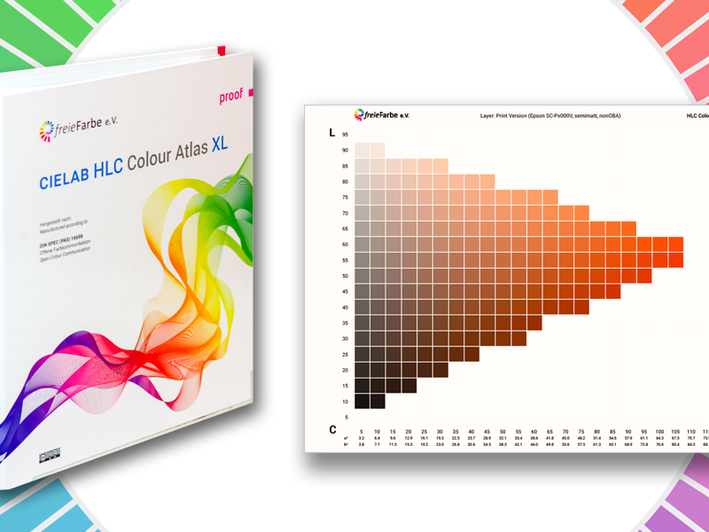

# 🎨 HLC-Colour-Atlas-XL Connect

Willkommen in einer **offenen Farbwelt**.  
Dieses Projekt ist eine **freie, ICC-basierte Alternative zu Pantone Connect** – mit vollem Fokus auf **Transparenz, Modularität und Präzision im Druck-Workflow**.

## 🧰 Features
- 🎨 Gitter mit HLC-Farben
- 🔍 Filter + Suche
- 🔁 Konvertieren (CMYK/LAB → HLC via ICC)
- 🖱️ Extrahieren per Bild-Upload
- 💾 Export `.json` / `.csv`
- 📦 ICC-Unterstützung

## 🙌 Credits
- [FreieFarbe.de](https://freiefarbe.de)
- GamutMap.org
- ArtistPigments.org

## 📄 Lizenz
Open Source (MIT)

## 🖼️ Screenshot
